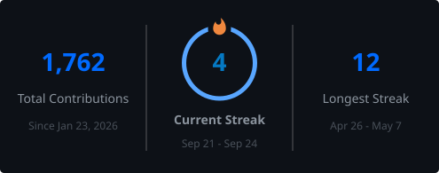

<!-- Banner -->


<p align="center">
  
</p>

<p align="center">
  
</p>

<!-- About -->


<p align="center">
  
</p>

```diff
+ Full-stack developer with a nuclear engineering background
+ Design office → control room → web products
```

<p align="center">
  <i>I moved from <b>nuclear design and operations</b> into software — bringing the same habits that matter in critical systems:<br/>
  <b>clarity, reliability, and calm under pressure</b>.</i>
</p>

<p align="center">
  Today I build full-stack web apps with a strong eye for <b>layout, flow, and detail</b>.<br/>
  I care about interfaces that feel <b>intentional</b> — not just functional.
</p>

<p align="center">
  
</p>

<!-- Snapshot -->


<p align="center">
  
</p>
<p align="center">
  
</p>
<p align="center">
  
</p>
<p align="center">
  
</p>

<p align="center">
  <br/>
  <b>Currently</b><br/><br/>
  💼 Full-Stack Web Developer &nbsp;·&nbsp; 🌱 Exploring <b>OpenClaw</b> & <b>Next.js</b><br/>
  🎸 Guitar &nbsp;·&nbsp; 🥁 Drums &nbsp;·&nbsp; 🚴 Cycling &nbsp;·&nbsp; 🏃 Running &nbsp;·&nbsp; ✈️ Travel
</p>

<p align="center">
  
</p>

<!-- Stack -->


<p align="center">
  <sub><i>Tools I reach for when design, logic, and shipping need to align.</i></sub>
</p>

<p align="center">
  
</p>

<p align="center">
  
</p>

<!-- Statistics -->


<p align="center">
  <sub><i>A snapshot of how I show up on GitHub — consistency over noise.</i></sub>
</p>

<p align="center">
  
</p>

<p align="center">
  <a href="https://github.com/Gaet9">
    
  </a>
</p>

<p align="center">
  <a href="https://github.com/Gaet9">
    
  </a>
</p>

<p align="center">
  <a href="https://github.com/Gaet9">
    
  </a>
</p>

<p align="center">
  
</p>

<p align="center">
  
</p>

<p align="center">
  
</p>

<p align="center">
  
</p>

<p align="center">
  
</p>

<p align="center">
  
</p>

<!-- How I work -->


<p align="center">
  
  <br/><br/>
  <b>Design with intent</b><br/>
  <sub>Hierarchy, spacing, and flows that feel obvious</sub>
</p>

<p align="center">
  
  <br/><br/>
  <b>Build with discipline</b><br/>
  <sub>Clean components, typed APIs, tested behavior</sub>
</p>

<p align="center">
  
  <br/><br/>
  <b>Ship with care</b><br/>
  <sub>Performance, accessibility, and maintainability</sub>
</p>

<p align="center">
  
</p>

<!-- Contact -->


<p align="center">
  <sub>Have a product idea, a tricky UI problem, or a team that needs an engineer who thinks in systems?</sub>
</p>

<p align="center">
  <a href="mailto:gaetan.delorgeril@gmail.com">
    
  </a>
  <br/><br/>
  <a href="https://www.linkedin.com/in/ga%C3%A9tan-de-lorgeril-167a36158/" target="_blank">
    
  </a>
  &nbsp;
  <a href="https://github.com/Gaet9" target="_blank">
    
  </a>
</p>

<br/>

<!-- Footer -->


<p align="center">
  
</p>
